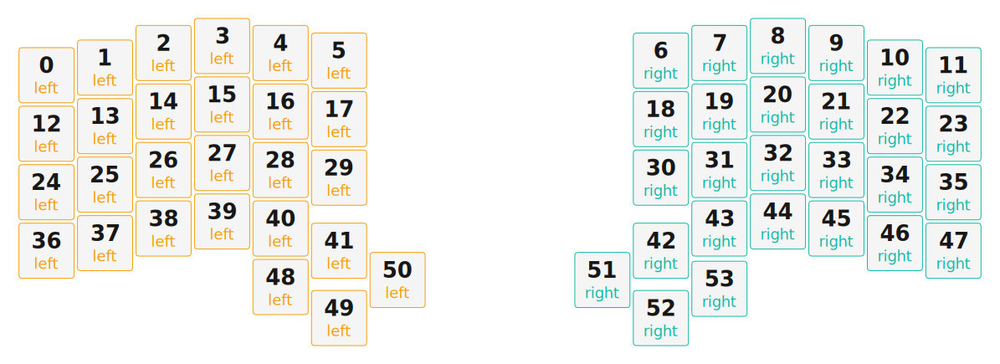

# ZMK Configuration for OC0

*Generated by Shield Wizard for ZMK*



Download compiled firmware from the Actions tab. <https://zmk.dev/docs/user-setup#installing-the-firmware>

Edit your keymap <https://zmk.dev/docs/keymaps>.
User keymap is located at [`config/oc0.keymap`](config/oc0.keymap).

-----

<details>
<summary>
Shield Wizard Debug Information
</summary>

In case of broken configuration, here is the Shield Wizard internal data used to generate this configuration:

Commit: 63ab9b7bd8845252979f45da72f40210b0b1a3ae

```json
{"name":"OC0","shield":"oc0","dongle":false,"modules":[],"layout":[{"id":"01KTWMBT887DH4CQRVVNV704GK","part":0,"row":0,"col":0,"w":1,"h":1,"x":0,"y":0.5,"r":0,"rx":0,"ry":0},{"id":"01KTWMBT881RQR8EG6BR57KGX3","part":0,"row":0,"col":1,"w":1,"h":1,"x":1,"y":0.37,"r":0,"rx":0,"ry":0},{"id":"01KTWMBT88DZR2HNKVXJC2AXA5","part":0,"row":0,"col":2,"w":1,"h":1,"x":2,"y":0.12,"r":0,"rx":0,"ry":0},{"id":"01KTWMBT88A6WXP11MWRP4CG90","part":0,"row":0,"col":3,"w":1,"h":1,"x":3,"y":0,"r":0,"rx":0,"ry":0},{"id":"01KTWMBT8865JHN1R70CM57MM0","part":0,"row":0,"col":4,"w":1,"h":1,"x":4,"y":0.12,"r":0,"rx":0,"ry":0},{"id":"01KTWMBT886B5991EGETANZQSV","part":0,"row":0,"col":5,"w":1,"h":1,"x":5,"y":0.25,"r":0,"rx":0,"ry":0},{"id":"01KTWMBT88B8S8EB9PVRBQ0KQY","part":1,"row":0,"col":8,"w":1,"h":1,"x":10.5,"y":0.25,"r":0,"rx":0,"ry":0},{"id":"01KTWMBT88DY8255AX1WBWA1DW","part":1,"row":0,"col":9,"w":1,"h":1,"x":11.5,"y":0.12,"r":0,"rx":0,"ry":0},{"id":"01KTWMBT88K8RFC3P32JCN77DK","part":1,"row":0,"col":10,"w":1,"h":1,"x":12.5,"y":0,"r":0,"rx":0,"ry":0},{"id":"01KTWMBT88WQ77PZ9N8WN38HR3","part":1,"row":0,"col":11,"w":1,"h":1,"x":13.5,"y":0.12,"r":0,"rx":0,"ry":0},{"id":"01KTWMBT88PZN2FBNXK63MMSYR","part":1,"row":0,"col":12,"w":1,"h":1,"x":14.5,"y":0.37,"r":0,"rx":0,"ry":0},{"id":"01KTWMBT888MEZWX9JJ8M3WXHP","part":1,"row":0,"col":13,"w":1,"h":1,"x":15.5,"y":0.5,"r":0,"rx":0,"ry":0},{"id":"01KTWMBT88V24DRCHNMKK7BDSP","part":0,"row":1,"col":0,"w":1,"h":1,"x":0,"y":1.5,"r":0,"rx":0,"ry":0},{"id":"01KTWMBT8814WTMM8FAYZ1SMQ5","part":0,"row":1,"col":1,"w":1,"h":1,"x":1,"y":1.37,"r":0,"rx":0,"ry":0},{"id":"01KTWMBT88WE077XQESXEBMF2G","part":0,"row":1,"col":2,"w":1,"h":1,"x":2,"y":1.12,"r":0,"rx":0,"ry":0},{"id":"01KTWMBT885F6VS4SMN3JCMJSM","part":0,"row":1,"col":3,"w":1,"h":1,"x":3,"y":1,"r":0,"rx":0,"ry":0},{"id":"01KTWMBT88KM72PHAZ33H3WN27","part":0,"row":1,"col":4,"w":1,"h":1,"x":4,"y":1.12,"r":0,"rx":0,"ry":0},{"id":"01KTWMBT8853GHJX5ZSAR72WWT","part":0,"row":1,"col":5,"w":1,"h":1,"x":5,"y":1.25,"r":0,"rx":0,"ry":0},{"id":"01KTWMBT88YVGQYXXF2MYPCFFW","part":1,"row":1,"col":8,"w":1,"h":1,"x":10.5,"y":1.25,"r":0,"rx":0,"ry":0},{"id":"01KTWMBT88910H767NZ3CY8ENG","part":1,"row":1,"col":9,"w":1,"h":1,"x":11.5,"y":1.12,"r":0,"rx":0,"ry":0},{"id":"01KTWMBT88MDJ5MM8KKCSK2EM8","part":1,"row":1,"col":10,"w":1,"h":1,"x":12.5,"y":1,"r":0,"rx":0,"ry":0},{"id":"01KTWMBT884V2VYCGY6VV5997S","part":1,"row":1,"col":11,"w":1,"h":1,"x":13.5,"y":1.12,"r":0,"rx":0,"ry":0},{"id":"01KTWMBT89T5Y8DVNXJZ0KCATK","part":1,"row":1,"col":12,"w":1,"h":1,"x":14.5,"y":1.37,"r":0,"rx":0,"ry":0},{"id":"01KTWMBT89NHCV9PGHVGBBZ01P","part":1,"row":1,"col":13,"w":1,"h":1,"x":15.5,"y":1.5,"r":0,"rx":0,"ry":0},{"id":"01KTWMBT893T668WG95WQ39E51","part":0,"row":2,"col":0,"w":1,"h":1,"x":0,"y":2.5,"r":0,"rx":0,"ry":0},{"id":"01KTWMBT89BSH3JSP4NB1X1WAE","part":0,"row":2,"col":1,"w":1,"h":1,"x":1,"y":2.37,"r":0,"rx":0,"ry":0},{"id":"01KTWMBT89EJQ2VN8KD8NJJFEX","part":0,"row":2,"col":2,"w":1,"h":1,"x":2,"y":2.12,"r":0,"rx":0,"ry":0},{"id":"01KTWMBT893CJFDJZK08078ED8","part":0,"row":2,"col":3,"w":1,"h":1,"x":3,"y":2,"r":0,"rx":0,"ry":0},{"id":"01KTWMBT89T2Q2ET1YHKK3CNH2","part":0,"row":2,"col":4,"w":1,"h":1,"x":4,"y":2.12,"r":0,"rx":0,"ry":0},{"id":"01KTWMBT89BKMH11EXPSFQFFMC","part":0,"row":2,"col":5,"w":1,"h":1,"x":5,"y":2.25,"r":0,"rx":0,"ry":0},{"id":"01KTWMBT893T1D6S4XTAW619HZ","part":1,"row":2,"col":8,"w":1,"h":1,"x":10.5,"y":2.25,"r":0,"rx":0,"ry":0},{"id":"01KTWMBT89D45737R5GQ967HHD","part":1,"row":2,"col":9,"w":1,"h":1,"x":11.5,"y":2.12,"r":0,"rx":0,"ry":0},{"id":"01KTWMBT897WYJ1NYPGCA5GYMA","part":1,"row":2,"col":10,"w":1,"h":1,"x":12.5,"y":2,"r":0,"rx":0,"ry":0},{"id":"01KTWMBT89RME4CVHDDEGCNKE7","part":1,"row":2,"col":11,"w":1,"h":1,"x":13.5,"y":2.12,"r":0,"rx":0,"ry":0},{"id":"01KTWMBT89QZ9RS92JZYQA69NM","part":1,"row":2,"col":12,"w":1,"h":1,"x":14.5,"y":2.37,"r":0,"rx":0,"ry":0},{"id":"01KTWMBT89BMZZFVGXS5VXQC9E","part":1,"row":2,"col":13,"w":1,"h":1,"x":15.5,"y":2.5,"r":0,"rx":0,"ry":0},{"id":"01KTWMBT89BKYYX1CZJFGHVP56","part":0,"row":3,"col":0,"w":1,"h":1,"x":0,"y":3.5,"r":0,"rx":0,"ry":0},{"id":"01KTWMBT89ZZ7MXKW49ZQQVBRS","part":0,"row":3,"col":1,"w":1,"h":1,"x":1,"y":3.37,"r":0,"rx":0,"ry":0},{"id":"01KTWMBT89KA94K9QTD5HMYTSF","part":0,"row":3,"col":2,"w":1,"h":1,"x":2,"y":3.12,"r":0,"rx":0,"ry":0},{"id":"01KTWMBT896W1R3FQ3EKMWT5PM","part":0,"row":3,"col":3,"w":1,"h":1,"x":3,"y":3,"r":0,"rx":0,"ry":0},{"id":"01KTWMBT89X94QZJNC595E9CAQ","part":0,"row":3,"col":4,"w":1,"h":1,"x":4,"y":3.12,"r":0,"rx":0,"ry":0},{"id":"01KTWMBT89NEK8Z6MWP4G5KV6Z","part":0,"row":3,"col":5,"w":1,"h":1,"x":5,"y":3.5,"r":0,"rx":0,"ry":0},{"id":"01KTWMBT89JYJJC4DG3YY5HHRH","part":1,"row":3,"col":8,"w":1,"h":1,"x":10.5,"y":3.5,"r":0,"rx":0,"ry":0},{"id":"01KTWMBT89A9KR6N7TSYQM923R","part":1,"row":3,"col":9,"w":1,"h":1,"x":11.5,"y":3.12,"r":0,"rx":0,"ry":0},{"id":"01KTWMBT894MGH9KFC9TXQBKYN","part":1,"row":3,"col":10,"w":1,"h":1,"x":12.5,"y":3,"r":0,"rx":0,"ry":0},{"id":"01KTWMBT8907V43JY6S44YZW0P","part":1,"row":3,"col":11,"w":1,"h":1,"x":13.5,"y":3.12,"r":0,"rx":0,"ry":0},{"id":"01KTWMBT89EKFGEPF162JV04XG","part":1,"row":3,"col":12,"w":1,"h":1,"x":14.5,"y":3.37,"r":0,"rx":0,"ry":0},{"id":"01KTWMBT89SWTBX993VR7PMX94","part":1,"row":3,"col":13,"w":1,"h":1,"x":15.5,"y":3.5,"r":0,"rx":0,"ry":0},{"id":"01KTWMBT89BK9XA89EZ383357M","part":0,"row":4,"col":3,"w":1,"h":1,"x":4,"y":4.12,"r":0,"rx":0,"ry":0},{"id":"01KTWMBT89JE7XGN8MYJ850GGB","part":0,"row":4,"col":4,"w":1,"h":1,"x":5,"y":4.65,"r":0,"rx":0,"ry":0},{"id":"01KTWMBT89JYMGG0VRMD72VF3D","part":0,"row":4,"col":5,"w":1,"h":1,"x":6,"y":4,"r":0,"rx":0,"ry":0},{"id":"01KTWMBT8AE4WQ5WS3J4BAW3N8","part":1,"row":4,"col":8,"w":1,"h":1,"x":9.5,"y":4,"r":0,"rx":0,"ry":0},{"id":"01KTWMBT8AY84YTVC3616Y7GH8","part":1,"row":4,"col":9,"w":1,"h":1,"x":10.5,"y":4.65,"r":0,"rx":0,"ry":0},{"id":"01KTWMBT8AS8VT1MGY0491F2Q0","part":1,"row":4,"col":10,"w":1,"h":1,"x":11.5,"y":4.15,"r":0,"rx":0,"ry":0}],"parts":[{"name":"left","controller":"nice_nano_v2","wiring":"matrix_diode","pins":{"d21":"input","d20":"input","d19":"input","d18":"input","d15":"input","d14":"output","d16":"output","d10":"output","d9":"output","d8":"output","d7":"output"},"keys":{"01KTWMBT887DH4CQRVVNV704GK":{"input":"d21","output":"d7"},"01KTWMBT881RQR8EG6BR57KGX3":{"input":"d21","output":"d8"},"01KTWMBT88DZR2HNKVXJC2AXA5":{"input":"d21","output":"d9"},"01KTWMBT88A6WXP11MWRP4CG90":{"input":"d21","output":"d10"},"01KTWMBT8865JHN1R70CM57MM0":{"input":"d21","output":"d16"},"01KTWMBT886B5991EGETANZQSV":{"input":"d21","output":"d14"},"01KTWMBT88V24DRCHNMKK7BDSP":{"input":"d20","output":"d7"},"01KTWMBT8814WTMM8FAYZ1SMQ5":{"input":"d20","output":"d8"},"01KTWMBT88WE077XQESXEBMF2G":{"input":"d20","output":"d9"},"01KTWMBT885F6VS4SMN3JCMJSM":{"input":"d20","output":"d10"},"01KTWMBT88KM72PHAZ33H3WN27":{"input":"d20","output":"d16"},"01KTWMBT8853GHJX5ZSAR72WWT":{"input":"d20","output":"d14"},"01KTWMBT893T668WG95WQ39E51":{"input":"d19","output":"d7"},"01KTWMBT89BSH3JSP4NB1X1WAE":{"input":"d19","output":"d8"},"01KTWMBT89EJQ2VN8KD8NJJFEX":{"input":"d19","output":"d9"},"01KTWMBT893CJFDJZK08078ED8":{"input":"d19","output":"d10"},"01KTWMBT89T2Q2ET1YHKK3CNH2":{"input":"d19","output":"d16"},"01KTWMBT89BKMH11EXPSFQFFMC":{"input":"d19","output":"d14"},"01KTWMBT89BKYYX1CZJFGHVP56":{"input":"d18","output":"d7"},"01KTWMBT89ZZ7MXKW49ZQQVBRS":{"input":"d18","output":"d8"},"01KTWMBT89KA94K9QTD5HMYTSF":{"input":"d18","output":"d9"},"01KTWMBT896W1R3FQ3EKMWT5PM":{"input":"d18","output":"d10"},"01KTWMBT89X94QZJNC595E9CAQ":{"input":"d18","output":"d16"},"01KTWMBT89NEK8Z6MWP4G5KV6Z":{"input":"d18","output":"d14"},"01KTWMBT89BK9XA89EZ383357M":{"input":"d15","output":"d10"},"01KTWMBT89JE7XGN8MYJ850GGB":{"input":"d15","output":"d16"},"01KTWMBT89JYMGG0VRMD72VF3D":{"input":"d15","output":"d14"}},"encoders":[],"buses":[{"name":"spi0","devices":[],"type":"spi"},{"name":"spi1","devices":[],"type":"spi"},{"name":"spi2","devices":[],"type":"spi"},{"name":"spi3","devices":[],"type":"spi"},{"name":"i2c0","devices":[],"type":"i2c"},{"name":"i2c1","devices":[],"type":"i2c"}]},{"name":"right","controller":"nice_nano_v2","wiring":"matrix_diode","pins":{"d21":"input","d20":"input","d19":"input","d18":"input","d15":"input","d14":"output","d16":"output","d10":"output","d9":"output","d8":"output","d7":"output"},"keys":{"01KTWMBT88B8S8EB9PVRBQ0KQY":{"input":"d21","output":"d14"},"01KTWMBT88DY8255AX1WBWA1DW":{"input":"d21","output":"d16"},"01KTWMBT88K8RFC3P32JCN77DK":{"input":"d21","output":"d10"},"01KTWMBT88WQ77PZ9N8WN38HR3":{"input":"d21","output":"d9"},"01KTWMBT88PZN2FBNXK63MMSYR":{"input":"d21","output":"d8"},"01KTWMBT888MEZWX9JJ8M3WXHP":{"input":"d21","output":"d7"},"01KTWMBT88YVGQYXXF2MYPCFFW":{"input":"d20","output":"d14"},"01KTWMBT88910H767NZ3CY8ENG":{"input":"d20","output":"d16"},"01KTWMBT88MDJ5MM8KKCSK2EM8":{"input":"d20","output":"d10"},"01KTWMBT884V2VYCGY6VV5997S":{"input":"d20","output":"d9"},"01KTWMBT89T5Y8DVNXJZ0KCATK":{"input":"d20","output":"d8"},"01KTWMBT89NHCV9PGHVGBBZ01P":{"input":"d20","output":"d7"},"01KTWMBT893T1D6S4XTAW619HZ":{"input":"d19","output":"d14"},"01KTWMBT89D45737R5GQ967HHD":{"input":"d19","output":"d16"},"01KTWMBT897WYJ1NYPGCA5GYMA":{"input":"d19","output":"d10"},"01KTWMBT89RME4CVHDDEGCNKE7":{"input":"d19","output":"d9"},"01KTWMBT89QZ9RS92JZYQA69NM":{"input":"d19","output":"d8"},"01KTWMBT89BMZZFVGXS5VXQC9E":{"input":"d19","output":"d7"},"01KTWMBT89A9KR6N7TSYQM923R":{"input":"d18","output":"d16"},"01KTWMBT89JYJJC4DG3YY5HHRH":{"input":"d18","output":"d14"},"01KTWMBT894MGH9KFC9TXQBKYN":{"input":"d18","output":"d10"},"01KTWMBT8907V43JY6S44YZW0P":{"input":"d18","output":"d9"},"01KTWMBT89EKFGEPF162JV04XG":{"input":"d18","output":"d8"},"01KTWMBT89SWTBX993VR7PMX94":{"input":"d18","output":"d7"},"01KTWMBT8AE4WQ5WS3J4BAW3N8":{"input":"d15","output":"d14"},"01KTWMBT8AY84YTVC3616Y7GH8":{"input":"d15","output":"d16"},"01KTWMBT8AS8VT1MGY0491F2Q0":{"input":"d15","output":"d10"}},"encoders":[],"buses":[{"name":"spi0","devices":[],"type":"spi"},{"name":"spi1","devices":[],"type":"spi"},{"name":"spi2","devices":[],"type":"spi"},{"name":"spi3","devices":[],"type":"spi"},{"name":"i2c0","devices":[],"type":"i2c"},{"name":"i2c1","devices":[],"type":"i2c"}]}]}
```

</details>
